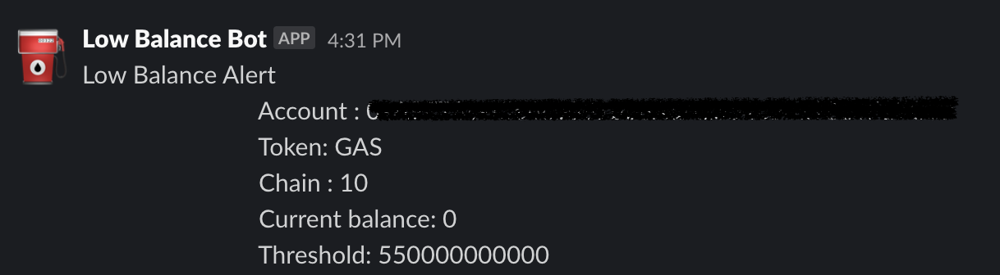

# Low Balance Alerts
This project monitors the balances of Faucet, Solver and VSC accounts, trigger alerts to slack channel.



## Requirements
This project was created using `bun v1.0.30`. Install [Bun](https://bun.sh) is a fast all-in-one JavaScript runtime.

## Config file
Configuration file required for service
```toml
[slack_api]
url = "<slack-url>"
[[chains]]
# Optimism
chainId = 10
  # faucet
  [[chains.tokens]]
  token = ""
  threshold =  "0.00000055"
  accounts = [ "<address1>" , "<address2>"]
  
  [[chains.tokens]]
  token = ""
  threshold =  "0.00000001"
  accounts = [ "<address1>" , "<address2>"]

[[chains]]
chainId = 534352
 # faucet
 [[chains.tokens]]
  token = ""
  threshold = "0.000018"
  accounts =  [ "<address1>" , "<address2>"]

# ---- Clip ---- 
```
### Installation
To install dependencies:

```bash
bun install
```

## Usage
To run:

```bash
bun start
```